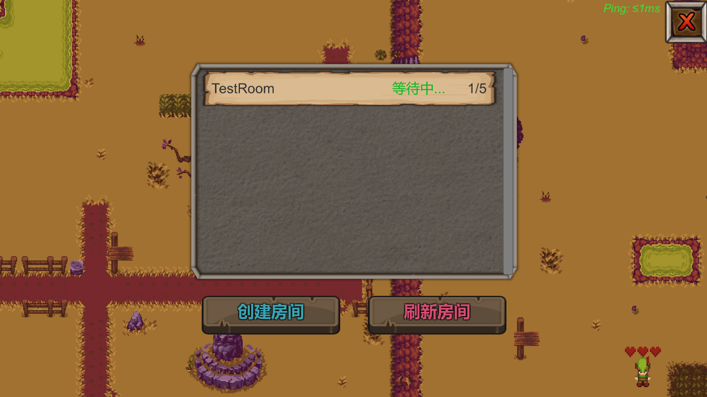
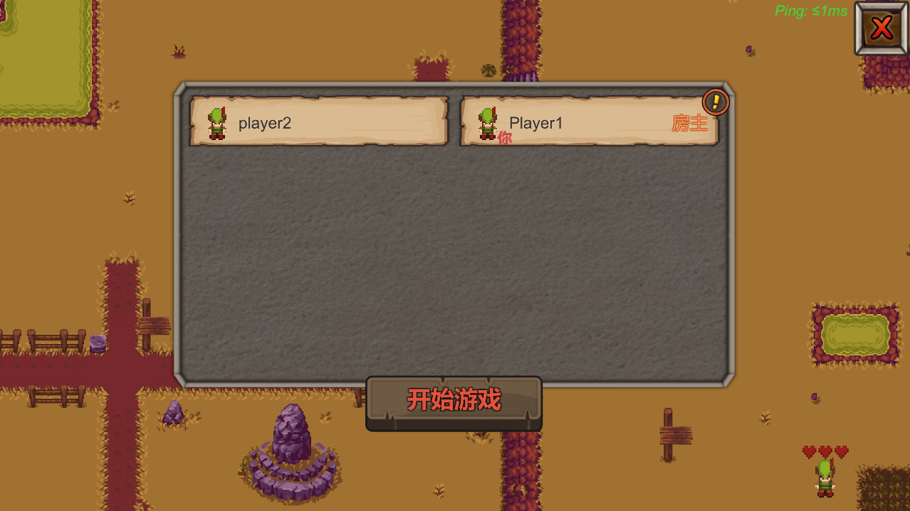
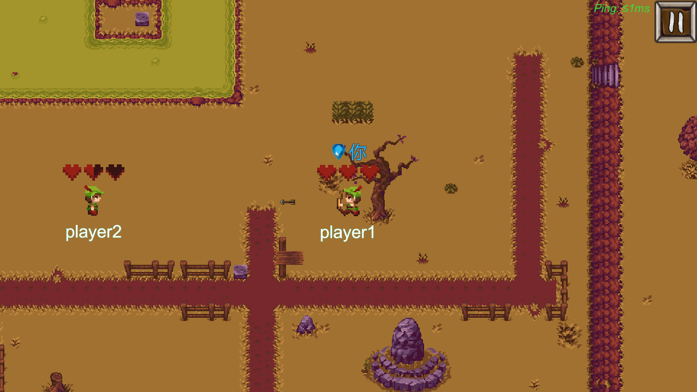
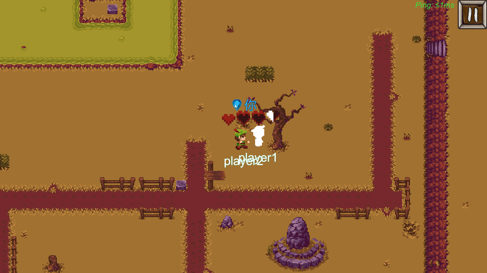
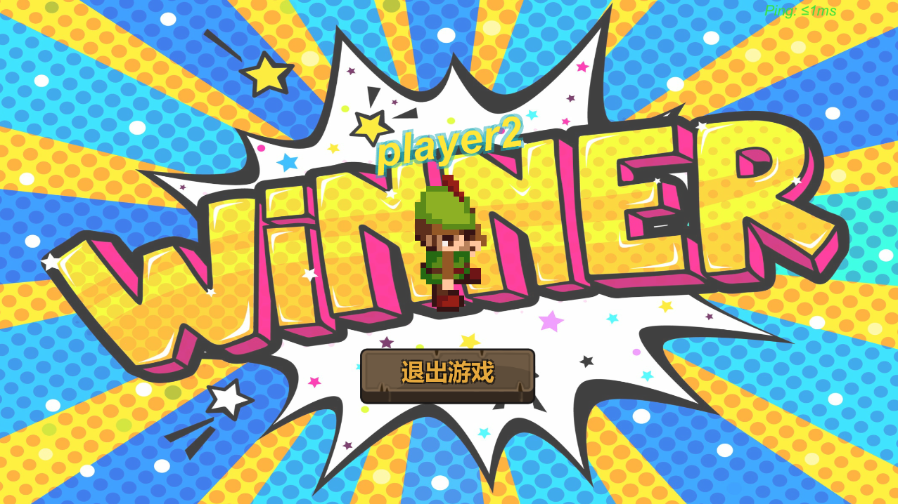
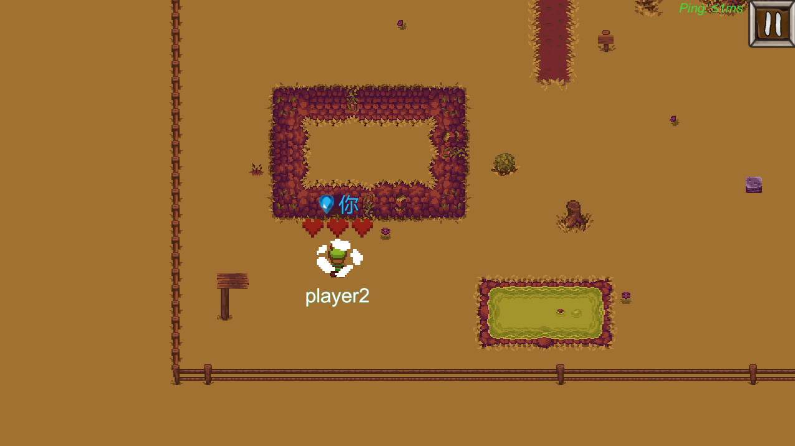
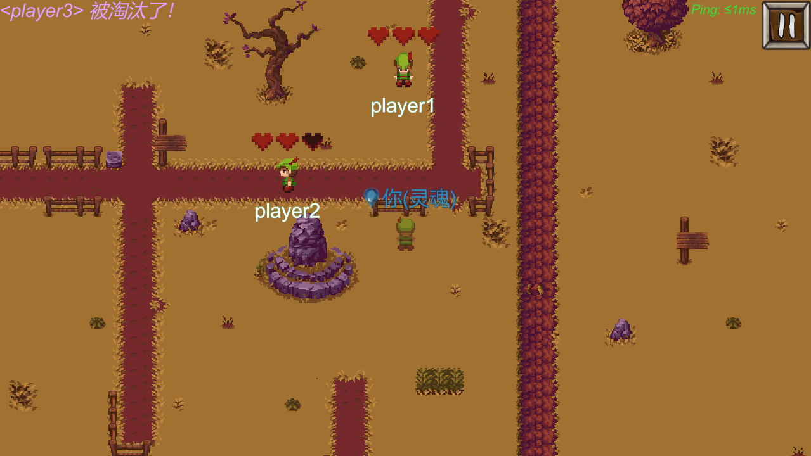

# TinyWarrior

Language: English | [简体中文](README.zh-CN.md)

## Introduction

This is a 2D multiplayer battle game made by Unity based on socket communication. If you want to play or test this game, the [TinyWarriorServer](https://github.com/ZerglingV/TinyWarriorServer "Tiny Warrior Server") is required.

Thank you for playing and please feel free to put any suggestions or bugs forward if you have any of them during the play.

## Installation

Download and decompress the released <strong><em>TinyWarrior_v1.0.rar</em></strong> compressed file and run <strong><em>TinyWarrior.exe</em></strong> to play the game. Please see [TinyWarriorServer](https://github.com/ZerglingV/TinyWarriorServer) for details to know the server operation.

## Gameplay and controls

Control your hero's movement and attack to defeat your opponent to win the game. Be careful not to be defeated by the enemy! Your health point is only 3.

| Key     | Action                     |
| ------- | -------------------------- |
| W/Up    | Up                         |
| A/Left  | Left                       |
| S/Down  | Down                       |
| D/Right | Right                      |
| J       | ranged attack (0.5 damage) |
| K       | melee attack (1 damage)    |
| ESC     | open menu/close menu       |

## Game Screenshots

<b>Room list</b>

<b>Player list</b>

<b>Ranged attack</b>

<b>Melee attack</b>

<b>Win</b>

<b>Teleport</b>

<b>Ghost state (Observer)</b>

## Known bugs

1. When multiple players are in a room, lose data package sometimes.
2. Other players' transport effects cannot be displayed.

## Copyright

Part of the contents and pictures are from the network, the copyright belongs to the original author or website. If there is copyright infringement, please contact me to delete it.
