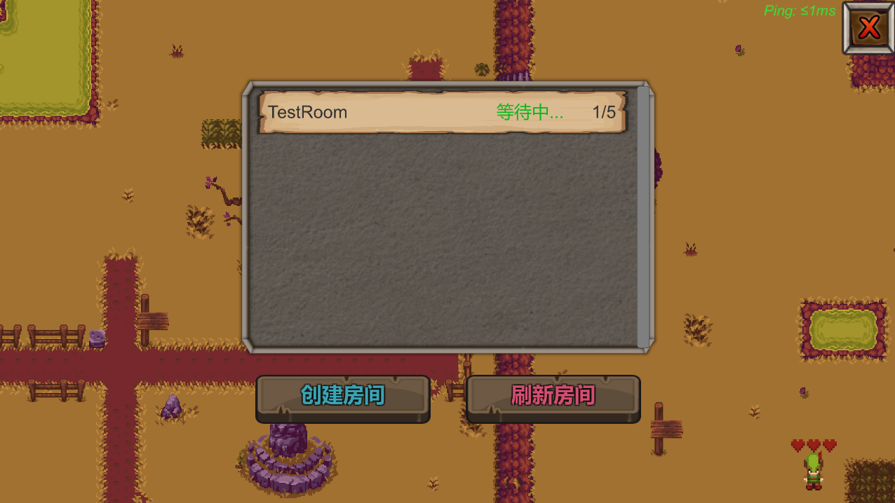
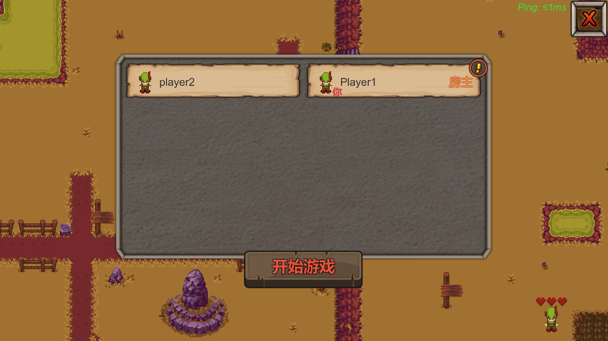
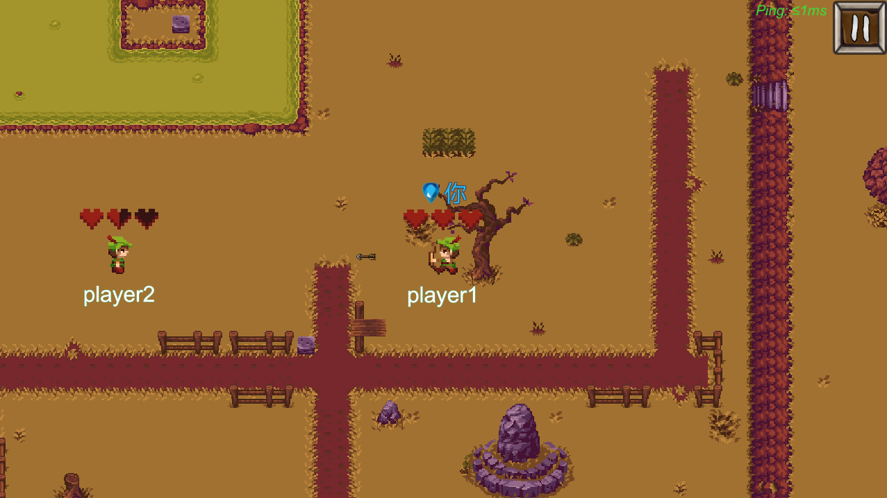
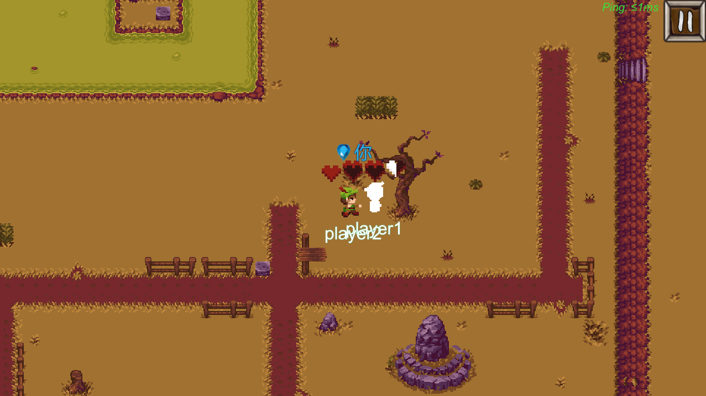
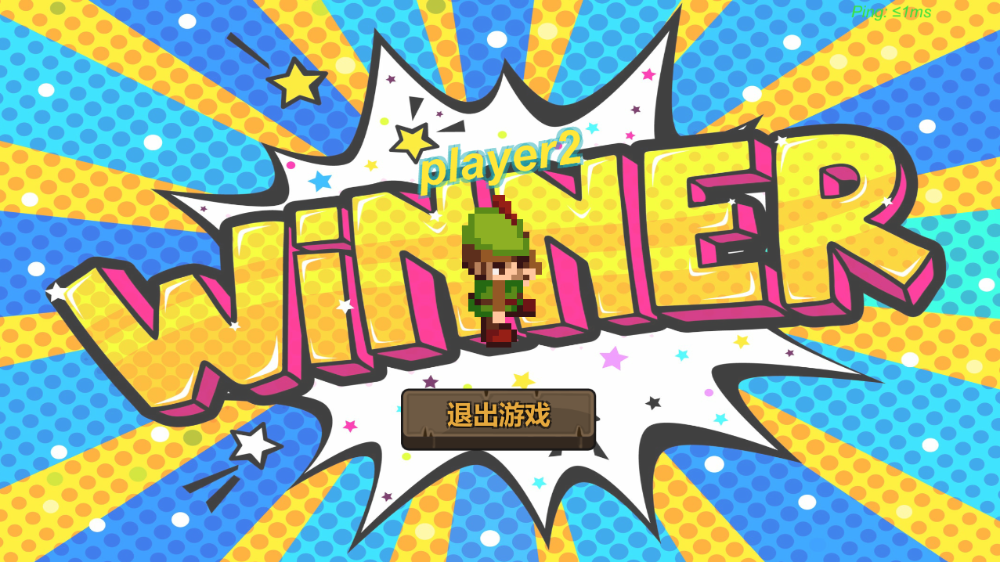
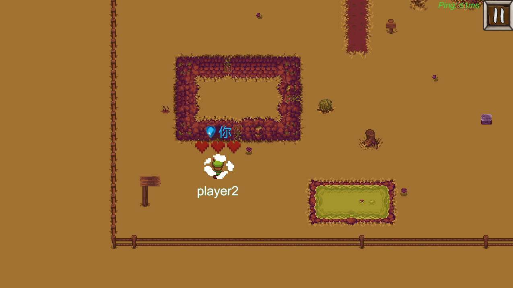
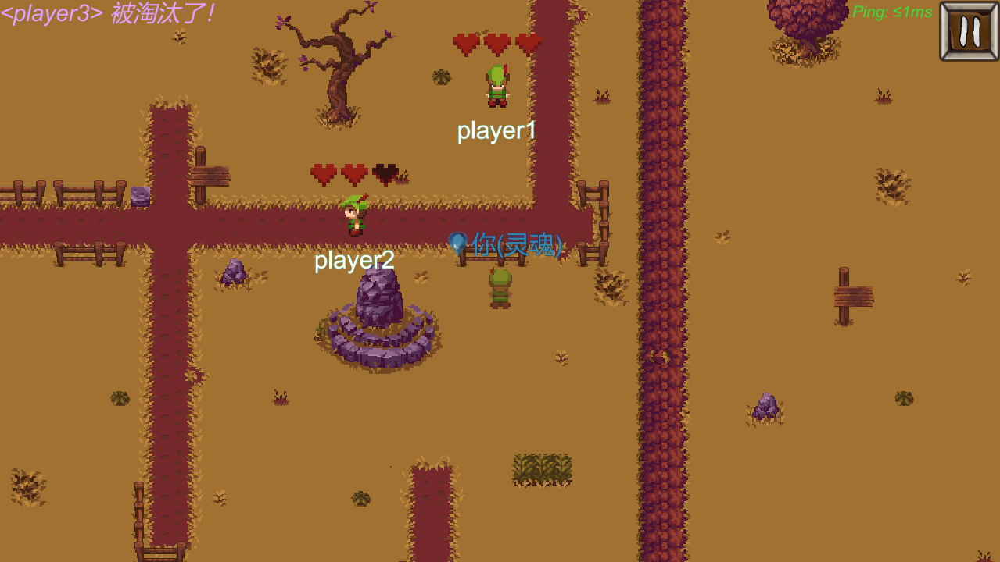

# TinyWarrior

语言：[English](README.md) | 简体中文

## 简介

这是一个通过 Unity 制作，基于 Socket 通信的 2D 多人对战游戏。如果想游玩或测试该游戏，则必须要服务端程序 [TinyWarriorServer](https://github.com/ZerglingV/TinyWarriorServer)。

感谢您的游玩，同时如果在游玩过程中有什么建议或发现什么漏洞欢迎提出。

## 安装

下载发布的 <strong><em>TinyWarrior_v1.0.rar</em></strong> 压缩文件，解压后通过执行 <strong><em>TinyWarrior.exe</em></strong> 进行游戏，服务器操作详见 [TinyWarriorServer](https://github.com/ZerglingV/TinyWarriorServer) 中的部分。

## 游戏玩法及操作

控制您的英雄进行移动和攻击，用它击败你的对手来获取游戏的胜利。小心别被敌人击败了！你的生命值只有 3。

| 按键    | 功能                 |
| ------- | -------------------- |
| W/Up    | 上                   |
| A/Left  | 左                   |
| S/Down  | 下                   |
| D/Right | 右                   |
| J       | 远程攻击（0.5 伤害） |
| K       | 近战攻击（1 伤害）   |
| ESC     | 打开菜单/关闭菜单    |

## 游戏截图

<b>房间列表</b>

<b>玩家列表</b>

<b>远程攻击</b>

<b>近战攻击</b>

<b>胜利</b>

<b>传送</b>

<b>幽灵形态（观战）</b>

## 已知漏洞

1. 在多人进入同一房间时，有时会出现数据包丢失。
2. 其他玩家的传送效果无法展示。

## 版权

部分内容和图片来自网络，版权归原作者或网站所有。 如果有侵犯版权的地方，请联系我删除。
